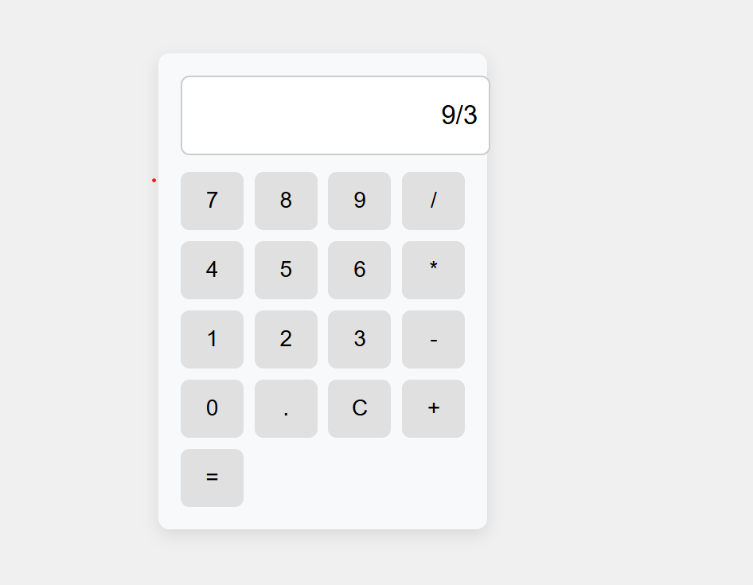
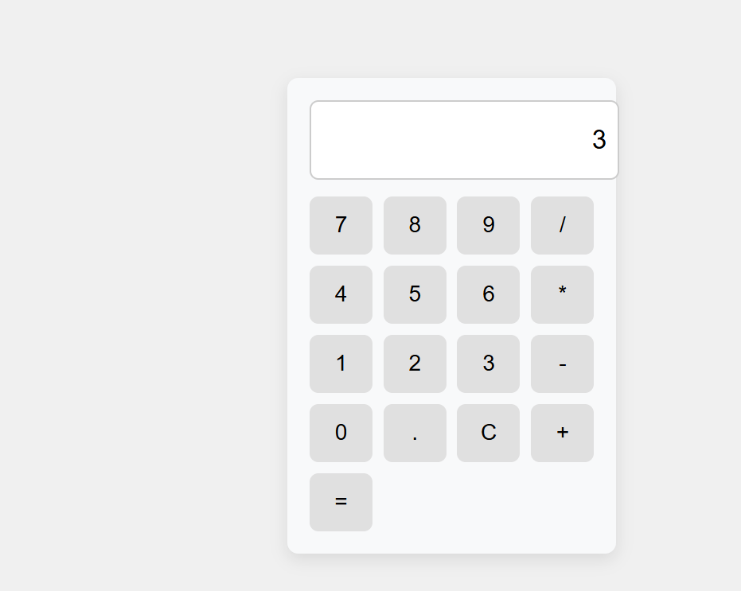

# MWAD-EXP_04-Simple-caluculator
## Date:30/04/25

## AIM
To  develop a Simple Calculator using React.js with clean and responsive design, ensuring a smooth user experience across different screen sizes.

## ALGORITHM
### STEP 1
Create a React App.

### STEP 2
Open a terminal and run:
  <ul><li>npx create-react-app simple-calculator</li>
  <li>cd simple-calculator</li>
  <li>npm start</li></ul>

### STEP 3
Inside the src/ folder, create a new file Calculator.js and define the basic structure.

### STEP 4
Plan the UI: Display screen, number buttons (0-9), operators (+, -, *, /), clear (C), and equal (=).

### STEP 5
Create a new file Calculator.css in src/ and add the styling.

### STEP 6
Open src/App.js and modify it.

### STEP 7
Start the development server.
  npm start

### STEP 8
Open http://localhost:3000/ in the browser.

### STEP 9
Test the calculator by entering numbers and operations.

### STEP 10
Fix styling issues and refine content placement.

### STEP 11
Deploy the website.

### STEP 12
Upload to GitHub Pages for free hosting.

## PROGRAM
## CAlCULATOR.JSX:
'''

    import React, { useState } from 'react';
    import './cal.css';
    
    const Calculator = () => {
      const [input, setInput] = useState('');
    
      const handleClick = (value) => {
        if (value === '=') {
          try {
            setInput(eval(input).toString());
          } catch {
            setInput('Error');
          }
        } else if (value === 'C') {
          setInput('');
        } else {
          setInput(input + value);
        }
      };
    
      const buttons = [
        '7', '8', '9', '/',
        '4', '5', '6', '*',
        '1', '2', '3', '-',
        '0', '.', 'C', '+',
        '='
      ];
    
      return (
    
            

              <input className="calculator-input" type="text" value={input} readOnly />
              

                {buttons.map((btn, i) => (
                  <button key={i} onClick={() => handleClick(btn)}>{btn}</button>
                ))}
              

            

          );
        };
    
    export default Calculator;

'''
## CALCULATOR.CSS:
'''

    .calculator {
        width: 260px;
        margin: 40px auto;
        padding: 20px;
        background: #f8f9fa;
        border-radius: 10px;
        box-shadow: 0 5px 15px rgba(0,0,0,0.1);
      }
      
      .calculator-input {
        width: 100%;
        height: 50px;
        font-size: 24px;
        margin-bottom: 15px;
        padding: 10px;
        text-align: right;
        border: 2px solid #ccc;
        border-radius: 8px;
      }
      
      .calculator-buttons {
        display: grid;
        grid-template-columns: repeat(4, 1fr);
        gap: 10px;
      }
      
      .calculator-buttons button {
        padding: 15px;
        font-size: 20px;
        border: none;
        border-radius: 8px;
        background-color: #e0e0e0;
        cursor: pointer;
        transition: background-color 0.2s;
      }
      
      .calculator-buttons button:hover {
        background-color: #d6d6d6;
      }
      
      .calculator-buttons button:active {
        background-color: #bcbcbc;
      }
      
'''

## OUTPUT

## RESULT
The program for developing a simple calculator in React.js is executed successfully.
